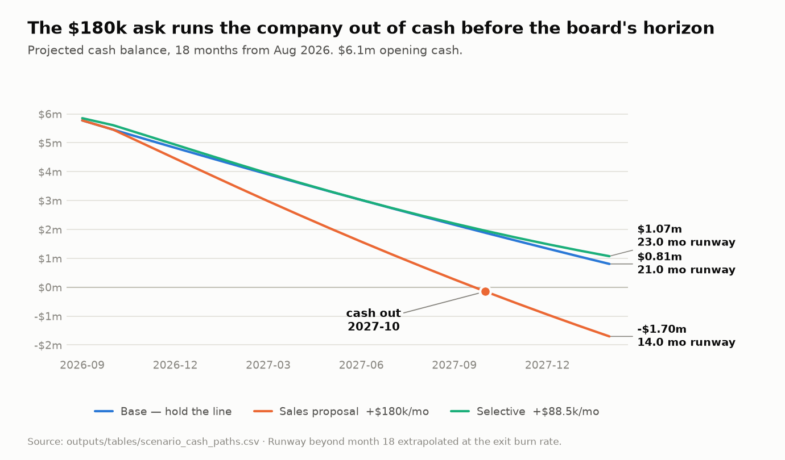
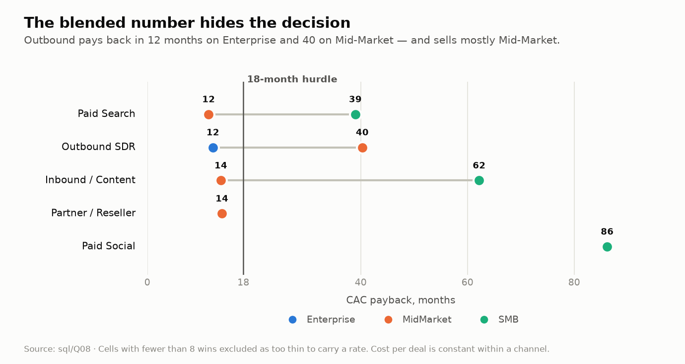
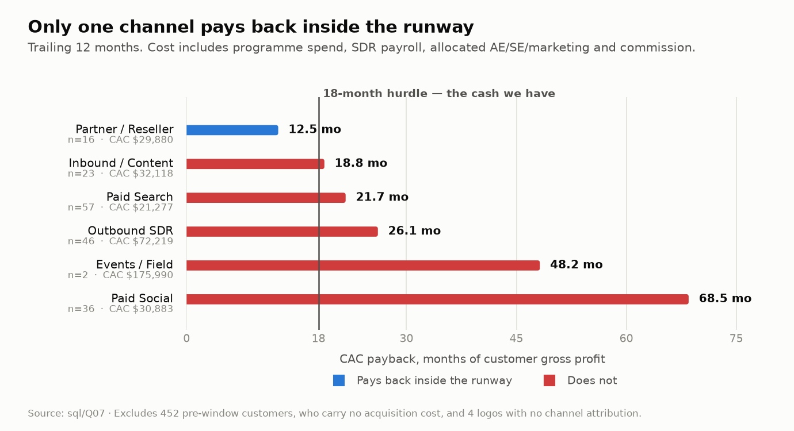
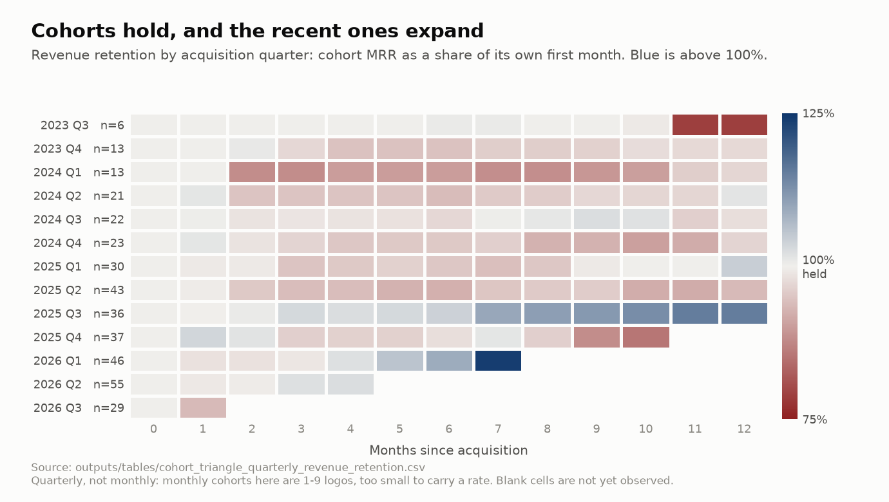
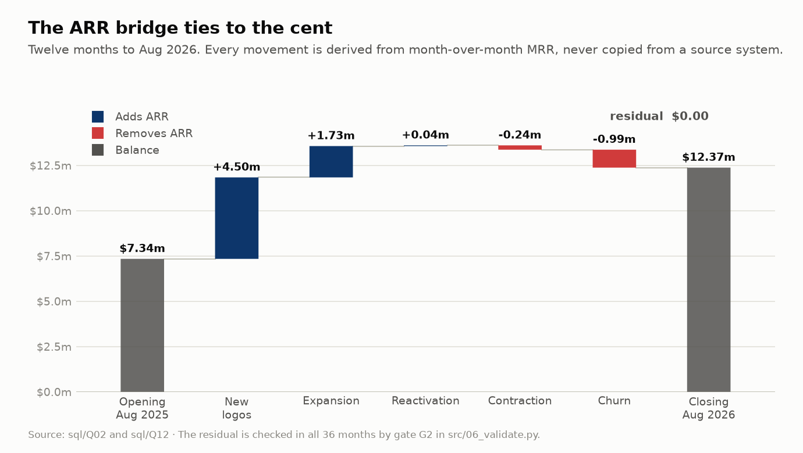

# Northwind Cloud — SaaS unit economics and runway analysis

> **The question, from the CEO:** *"We're burning $340k a month with $6.1m in the
> bank. Sales wants to double the SDR team — another $180k a month. I don't
> understand whether the current sales machine pays back at all. I need an answer
> before the board meets in two weeks."*

**The answer: hire selectively.** Reject the $180k request, approve an $88.5k
Enterprise-focused pod, and fund it by switching off Paid Social.

| | Base | Sales proposal (+$180k/mo) | **Selective (recommended)** |
|---|---:|---:|---:|
| Incremental S&M | $0 | $180,000/mo | **$88,500/mo** |
| Incremental CAC | — | $79,788 | **$45,671** |
| CAC payback | — | **28.0 months** | **11.2 months** |
| ARR at month 18 | $19.72m | $20.96m | **$21.04m** |
| Cash at month 18 | $806k | **−$1.70m** | **$1.07m** |
| Runway | 21 months | **14 months** | **23 months** |

The company has 18.2 months of cash. It cannot fund a 28-month payback. The
selective option delivers *more* ARR than the full proposal for half the money,
because it sells Enterprise deals that are 3.5x larger at the same cost to win.

<picture>
  <source media="(prefers-color-scheme: dark)" srcset="docs/img/cash-runway-by-scenario-dark.png">
  
</picture>

**→ [Read the full memo](docs/CEO_MEMO.md)**

---

## What this repository demonstrates, and what it cannot

Northwind Cloud is fictional and every number below comes from data this
repository generates itself. The effects the analysis "finds" — the Paid Social
lead-quality collapse, the SMB churn spike, the SDR saturation curve — are
planted in `config/assumptions.yml` and simulated forward. **Nobody discovered
anything about a real business here, and no finding below is evidence about the
world.**

What is demonstrable is everything between the data and the decision, and that
is what the repository is for:

- **the analysis recovers the planted effects from the data rather than reading
  them out of the config** — `tests/` asserts this on every run, comparing each
  measured figure against the parameter that produced it;
- **the reconciliations hold** — the ARR bridge ties to the cent, the cohort
  triangle foots to total MRR, the Excel workbook agrees with the warehouse
  (seven gates in `src/06_validate.py`);
- **the decision logic survives being argued with** — costs are allocated two
  different defensible ways and the recommendation is reported under both, which
  is how the headline below ended up carrying a caveat rather than a number.

A generator that plants an effect and an analysis that finds it is a closed
loop. It proves the machinery, not the conclusion, and the conclusions are
written up as if they were real only because that is the form the deliverable
takes.

---

## What the analysis found

**1. Outbound isn't one channel, it's two businesses.** Blended, it pays back in
26.1 months — mediocre and un-actionable. Split by segment, the answer is obvious:

| Outbound SDR, trailing 12m | Logos | Avg ACV | CAC | Payback |
|---|---:|---:|---:|---:|
| Enterprise | 13 | $93,486 | $72,219 | **12.6 months** |
| Mid-Market | 29 | $26,764 | $72,219 | **41.5 months** |
| SMB | 4 | $8,556 | $72,219 | 123.5 months |

An outbound deal costs about the same to win whatever its size. 29 of 46 wins
went into the segment where that cost takes forty months to return.

**That table charges every outbound deal the same CAC, and the recommendation
does not survive the alternative.** An Enterprise deal consumes more AE and
Sales Engineer time than an SMB one — `config/assumptions.yml` puts the ratio at
4.0 against SMB's 1.0 — so allocating the shared sales cost on effort instead of
headcount moves money onto exactly the deals the memo wants to buy more of:

| Outbound SDR | Payback, equal split | Payback, effort-weighted | Board guardrail |
|---|---:|---:|---|
| Enterprise | 12.6 months | **19.4 months** | 18 months — **misses** |
| Mid-Market | 41.5 months | 35.1 months | misses on both |
| SMB | 123.5 months | 47.4 months | misses on both |

The targeting decision holds either way: Enterprise is the best-paying slice of
outbound on both bases, and Mid-Market is a bad buy on both. What does not hold
is the claim that the pod pays back inside the board's guardrail. It clears 18
months only while an Enterprise deal costs less than about **3.6x** an SMB deal
in sales effort; this project's own assumption file says 4.0.

`src/10_allocation_sensitivity.py` prices every channel x segment both ways and
sweeps that ratio (`outputs/tables/allocation_sensitivity.csv`,
`allocation_breakeven.csv`). Paid Search Mid-Market has the same shape: 11.9
months on equal split, 19.4 effort-weighted.

<picture>
  <source media="(prefers-color-scheme: dark)" srcset="docs/img/payback-by-channel-segment-dark.png">
  
</picture>

Blended to a single number per channel, only Partner clears the bar at all:

<picture>
  <source media="(prefers-color-scheme: dark)" srcset="docs/img/cac-payback-by-channel-dark.png">
  
</picture>

**2. Paid Social returns 29 cents on the dollar.** It is the largest programme
line at $75,500/month. Over twelve months it consumed $1.11m of fully allocated
cost to buy $241,428 of new ARR at $6,706 a deal, churning at 6.34% per month —
a 68.5-month payback and LTV/CAC of **0.29**. Cohort retention at six months fell
from 91.4% to 64.8% after the agency switched to broad-reach bidding in November
2024; cost per lead fell, which is why the channel looked like it was working.

**3. Blended NRR of 104.7% hides a leaking segment.** Enterprise 121.1%,
Mid-Market 104.4%, SMB **82.0%**. SMB is 14.6% of ARR, 48% of new logos, and
pays back in 62 months.

<picture>
  <source media="(prefers-color-scheme: dark)" srcset="docs/img/cohort-retention-quarterly-dark.png">
  
</picture>

Retention by cohort is healthy — the leak is concentrated in SMB and in one
channel, not spread across the book.

**4. SDR #10 through #18 are not worth what SDR #3 was.** When the team went 4 →
9, meetings per fully-ramped rep fell from **12.50 to 9.49**. Extending that
decay to eighteen reps gives 5.50 incremental meetings per added rep; clearing an
18-month payback needs 8.57. The proposal is 36% short.

---

## Method

```
config/assumptions.yml ─→ 01 generate ─→ 02 warehouse ─→ 03 SQL library ─┐
                                                                         ├─→ 06 validate
                                          04 cash model ─→ 05 Excel ─────┘
                                                        ─→ 07 Power BI  ─→ 08 docs
                                                        ─→ 09 charts
```

| Step | Script | What it does |
|---|---|---|
| 1 | `01_generate_data.py` | Driver-based simulator: spend → leads → SQLs → wins → subscription lifecycle. Seeded and byte-reproducible. Grain: **subscription × month**, 36 months. |
| 2 | `02_build_warehouse.py` | SQLite star schema. 13 numbered cleaning rules, full `etl_audit` trail, `dq_quarantine` for everything removed. |
| 3 | `03_run_sql_library.py` | 12 analytical queries + 1 audit query. Two integrity gates abort the pipeline on failure. |
| 4 | `04_cashflow_model.py` | Forecast bake-off, then an 18-month, 3-scenario cash and runway model with break-even sensitivities. |
| 5 | `10_allocation_sensitivity.py` | Prices every channel x segment on both cost-allocation bases and sweeps the effort index to find where the answer flips. |
| 6 | `05_build_excel_model.py` | Formula-driven workbook with a live scenario switch. |
| 7 | `06_validate.py` | Seven gates: determinism, bridge, cohorts, audit, Excel recalculation, Excel-vs-SQL, scenario switch. |
| 8 | `07_export_powerbi.py` | Star-schema extracts + [DAX guide](docs/POWERBI_GUIDE.md). |
| 9 | `08_generate_docs.py` | Regenerates the [data dictionary](docs/DATA_DICTIONARY.md) and [cleaning rules](docs/CLEANING_RULES.md) from the warehouse. |
| 10 | `09_build_charts.py` | Renders the charts above from the warehouse, light and dark, so they cannot drift from the analysis. |

### Choices worth arguing with

**The forecast model was chosen by backtest, not by preference.** Five methods,
rolling-origin evaluation, two window policies, 93 out-of-sample points each:

| Method | MAPE (expanding) | MAPE (rolling-24) |
|---|---:|---:|
| **Holt linear** | **3.46%** | **3.42%** |
| Driver (NRR + new MRR) | 3.78% | 3.78% |
| Drift | 7.33% | 6.96% |
| Log-linear | 10.80% | 9.11% |
| Naive | 13.15% | 13.15% |

I expected the bottom-up driver model to win — it is the only candidate that
knows the series is a subscription book. It lost. Holt is used.

**CAC excludes 452 of 826 customers.** They were acquired before the S&M ledger
begins and carry no cost. Leaving them in the denominator roughly halves CAC.
This is the most common way SaaS CAC gets flattered, and the exclusion is
enforced in `v_new_business` rather than left to the analyst to remember.

**Missing attribution is never imputed.** Segment is imputed from ARR bands and
flagged. Channel is not — attribution cannot be reconstructed from revenue, so
those customers go to an `unattributed` bucket and out of every CAC denominator.

**LTV is shown three ways** because the simple version flatters everything:
perpetuity on logo churn, a 60-month horizon on observed net revenue retention,
and that horizon discounted at 1%/month. The recommendation uses the second. On
the perpetuity method Outbound looks like a 6.4x return; on the finite-horizon
method it is 3.0x. The perpetuity method assumes a constant hazard forever and
ignores contraction entirely.

**Outliers are flagged, not removed.** The only outlier treatment applied
anywhere is de-duplicating the February 2026 billing-migration double-post, which
has a documented mechanical cause. 18 extreme MRR movements carry
`outlier_flag = 1` and stay in the history. Removing unexplained outliers is
curve-fitting.

### The two weakest assumptions

**The cost allocation rule, which I did not expect to be the weak one.** Every
payback figure in this project depends on how the shared sales cost is split,
and the honest answer is that the recommendation clears the board's guardrail on
one defensible basis and misses it on the other (12.6 vs 19.4 months). Neither
basis is a measurement: effort weighting rests on an assumed 4.0x index, and
equal split rests on the assumption that deal size does not drive cost, which is
plainly false. The flip happens at about 3.6x. A real version of this analysis
would spend its next hour getting actual AE and SE hours per deal out of the
CRM, because that single number decides the answer.

**The pod holding an Enterprise-weighted win mix.** It fails the 18-month test
below roughly **19% Enterprise share** on the equal-split basis; the current
outbound team runs 28%. That is why it is a monitored condition of approval, not
a footnote. Territory overlap — the assumption I expected to be fragile — turned
out not to matter: even at 100% overlap payback is 16.4 months and still clears
on that basis.

---

## Verification

Nothing here is asserted without a check.

<picture>
  <source media="(prefers-color-scheme: dark)" srcset="docs/img/arr-bridge-waterfall-dark.png">
  
</picture>

`python src/06_validate.py`:

| Gate | Result |
|---|---|
| G1 Generator determinism (SHA-256 on re-run) | PASS — 6/6 files byte-identical |
| G2 ARR bridge ties to the cent | PASS — max residual **$0.0000** across 36 months |
| G3 Cohort triangle foots to total MRR | PASS — 36/36 months |
| G4 ETL audit accounts for every source row | PASS — 17,310 in, 176 quarantined with a reason |
| G5 Excel recalculates with zero formula errors | PASS — LibreOffice headless recalc |
| G6 Excel reconciles to SQL | PASS — **24/24** checks |
| G7 Scenario switch is live | PASS — 3 distinct cash paths, max Δ vs Python **$0.41** |

Tolerances are set to exactly half the last displayed unit of whatever produced
the reference value, so a PASS means "identical apart from display rounding" —
not "close enough". A green recalculation only proves nothing is broken, which is
why G6 and G7 exist separately.

`pytest tests -q` adds three groups the gates do not cover:

| Group | What it holds down |
|---|---|
| `test_recovery.py` | The analysis recovers each planted effect **from the data**: segment churn rates, deal sizes, the Paid Social collapse (measured 2.31x churn against 2.3x planted), the Enterprise expansion wave, the SMB price rise, the SDR saturation curve, the quarantined double-post, and the exclusion of the pre-window base from CAC. |
| `test_readme_claims.py` | Every figure quoted in this README and in the memo is read back out of `outputs/tables/` and matched. This exists because the outbound table here quoted a CAC of $70,164 and a 12.3-month payback for weeks while the pipeline had been producing $72,219 and 12.6. |
| `test_determinism.py` | A fresh run reproduces every committed table to a relative tolerance of 1e-6. Artefacts are written with ten significant digits rather than full float precision, because the sixteenth digit depends on the machine and turns "deterministic" into a coin flip. |

---

## Reproduce

```bash
git clone https://github.com/BakdauletBolatA/northwind-saas-unit-economics
cd northwind-saas-unit-economics
pip install -r requirements.txt
apt-get install -y libreoffice-calc     # G5-G7 recalculate the workbook headlessly
./run_all.sh                            # ~45 seconds end to end
pytest tests -q                         # 54 checks: recovery, claims, determinism
```

Everything is driven by `config/assumptions.yml`. Change a number there — a
channel's spend, a segment's churn, the SDR saturation exponent — re-run
`./run_all.sh`, and the whole chain moves, Excel workbook included. The seed is
fixed, so two runs of the generator produce byte-identical files.

### Output

| Path | What |
|---|---|
| `docs/CEO_MEMO.md` | The answer |
| `outputs/excel/northwind_unit_economics.xlsx` | Scenario model, live switch |
| `outputs/tables/*.csv` | SQL results, backtest, scenarios, reconciliation |
| `outputs/tables/allocation_sensitivity.csv` | Every channel x segment priced on both cost-allocation bases |
| `outputs/tables/allocation_breakeven.csv` | The effort-ratio sweep that decides the recommendation |
| `outputs/powerbi/*.csv` | Star-schema extracts |
| `docs/img/*.png` | The charts above, light and dark |
| `data/warehouse/northwind.db` | SQLite warehouse |

---

## The scenario

Northwind Cloud sells cloud warehouse-management software to B2B distributors on
subscription. It grew 2021–2023 on a low-touch SMB motion and has since moved
upmarket, which is why the installed base is SMB-heavy while new bookings are
not.

Six business events are planted in the generated data for the analysis to
recover, and the analysis recovers them from the data rather than from the
config: a Paid Social lead-quality collapse (Nov 2024), an Enterprise expansion
wave following a product launch (Jun 2025), an SMB price increase and the churn
spike behind it (Feb 2025), the SDR scale-up from 4 to 9 (Sep 2025), a partner
co-sell programme (Mar 2025), and a billing-engine migration that double-posted a
month of invoices (Feb 2026). The data also carries realistic defects — duplicate
billing lines, back-dated credit memos, orphan rows, negative-seat corruption and
missing attributes — which the ETL detects, handles and logs rather than being
handed clean input.

*Northwind Cloud is fictional and the data is synthetic, generated by this
repository's own driver-based simulator. See
[what this demonstrates](#what-this-repository-demonstrates-and-what-it-cannot)
at the top: the method, the reconciliations and the reasoning are the point;
the findings are not evidence about any real company.*
